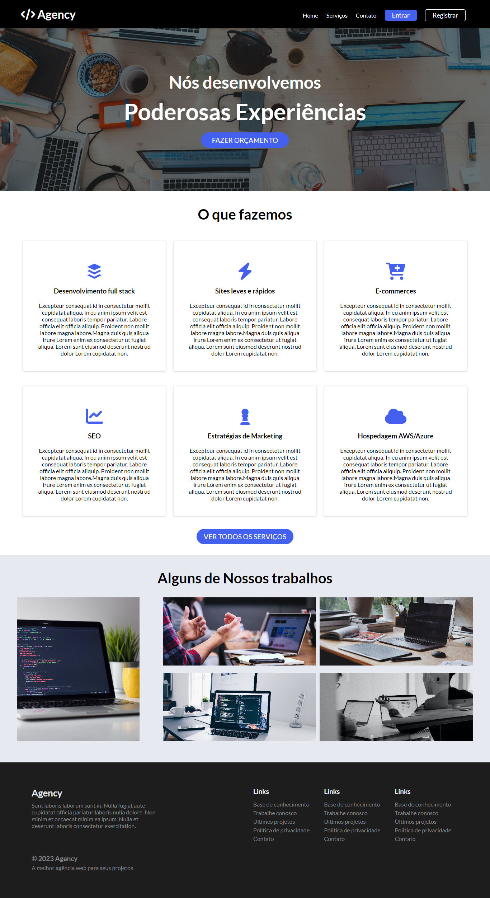

# Agency
Esta Landing Page foi projetada para represemtar uma agência que desenvolve sistemas web. A página possui um layout responsivo, profissional e moderno, com seções bem definidas que fornecem uma ótima experiência para o usuário. Sinta-se à vontade para personalizar e adaptar essa landing page de acordo com seus próprios projetos e necessidades.
<br>
<br>


# Recursos
A página possui os seguintes recursos:

- Header com menu de navegação, incluindo um logotipo, links para as páginas principais, botões de login e registro, e um ícone de menu responsivo para dispositivos móveis.
- Seção CTA (Call to Action) com um título principal, subtítulo e um botão para solicitar um orçamento.
- Seção de serviços, exibindo vários cartões com ícones, títulos e descrições de diferentes serviços oferecidos pela agência.
- Seção de trabalhos, mostrando alguns projetos realizados pela agência com títulos e descrições.
- Rodapé com informações sobre a agência, links úteis e direitos autorais.

# Tecnologias
A landing page da agência foi desenvolvida utilizando as seguintes tecnologias:

- HTML5: Linguagem de marcação para estruturar a página.
- CSS3: Utilizado para estilizar a página e criar os efeitos visuais.
- Sass: Pré-processador CSS utilizado para escrever estilos de forma mais eficiente.
- JavaScript: Utilizado para adicionar comportamentos interativos à página.
- Font Awesome: Biblioteca de ícones utilizada para adicionar ícones aos elementos da página.
- Google Fonts: Utilizado para importar e aplicar a fonte "Lato" aos textos da página.

# Organização dos Arquivos Sass

Os estilos da página foram organizados utilizando o pré-processador SASS (Syntactically Awesome Style Sheets). O arquivo style.sass contém os estilos principais da página e utiliza importações para incluir outros arquivos SASS. A estrutura dos arquivos SASS é a seguinte:

- variables.sass: Este arquivo contém variáveis que armazenam cores, tamanhos de fonte, espaçamentos e outras propriedades que são utilizadas nos estilos da página. Isso facilita a modificação e a consistência dos estilos.

- utilities.sass: Este arquivo contém utilitários, como mixins e funções, que são reutilizados em diferentes partes da página. Esses utilitários ajudam a simplificar o código e evitar a repetição.

- style.sass: Este é o arquivo principal que importa os arquivos variables.sass e utilities.sass. Ele contém os estilos específicos da página, como os estilos do menu, das seções e dos elementos individuais.

Através dessa estrutura de arquivos SASS, os estilos são organizados de forma modular e reutilizável, facilitando a manutenção e o desenvolvimento da landing page.

# Utilização

Para utilizar essa Landing Page na sua máquina siga os seguintes passos:

- Clone o repositório para sua máquina local utilizando o seguinte comando:
```bash
  git clone https://github.com/ViniciusQuintas/agency-landing-page.git
```
- Após clonar o repositório, navegue até o diretório da Landing Page no terminal:
```bash
  cd agency-landing-page
```
- Agora, abra o arquivo index.html no seu navegador para visualizar a página em ação.

# Contribuição
Se você deseja contribuir para o desenvolvimento dessa Landing page, siga os seguintes passos:

1️⃣ Faça um fork deste repositório. 
<br>
<br>
2️⃣ Crie uma nova branch para sua contribuição. 
<br>
<br>
3️⃣ Faça suas alterações no código. 
<br>
<br>
4️⃣  Certifique-se de que suas alterações não quebram o funcionamento existente da página. 
<br>
<br>
5️⃣ Faça um pull request com suas alterações. 
<br>
<br>

# Licença
Este projeto está licenciado sob a Licença MIT. Consulte o arquivo LICENSE para obter mais informações.
